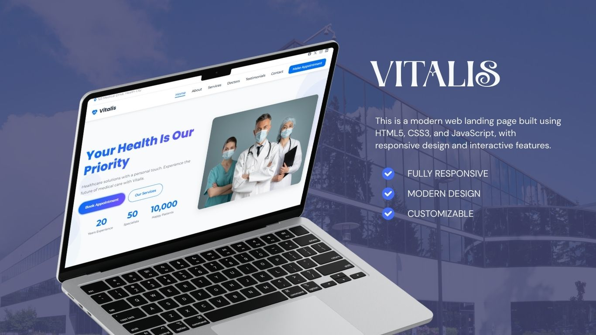
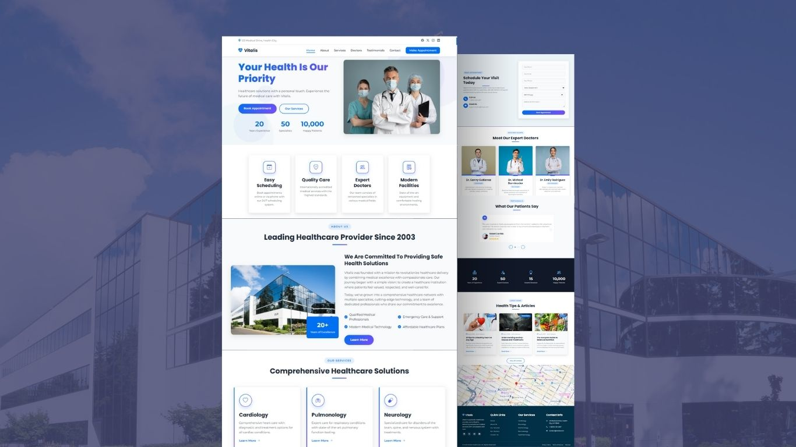

# Vitalis Hospital Website

A modern landing page built using HTML5, CSS3, and JavaScript, with responsive design and interactive features.

## Browser Support

Works great in all browsers (Chrome, Firefox, Safari, Edge). Haven't tested on IE and honestly don't plan to haha.

## Credits

- Images from Unsplash
- Icons from Bootstrap Icons
- Inspiration from various medical websites I've seen

Feel free to use this as inspiration for your own projects! If you end up using any part of this code, a shoutout would be nice but not required :)

Enjoy!
